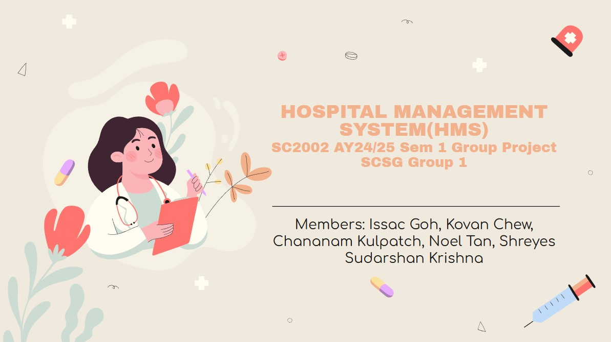

<strong>Hospital Management System(HMS)</strong> is a Java console application built using Object Oriented Principles. It allows for efficient access to hospital data by various stakeholders, such as doctors, pharmacists and patients. The system consists of various functions, such as management of hospital operations - patient management, staff management, appointment scheduling, and billing. The system is designed to be scalable by following the SOLID Principles.


##  Team Members
| Name                    | GitHub Account      |
|-------------------------|---------------------|
| Issac Goh | [Tortoisey1](https://github.com/Tortoisey1) |
| Kovan Chew     | https://github.com/Kovancwh99 |
| Noel Tan   |  |
| Chananam Kulpatch          |  |
| Shreyes           | |

##  Key Features

### Patient Menu
- View Medical Record
- Update Personal Information
- Schedule an Appointment
- Reschedule an Appointment
- Cancel an Appointment
- View Scheduled Appointments
- View Past Appointment Outcome Records
- View Outstanding Billing
- Logout

### Doctor Menu
- View Patient Medical Records
- View Personal Schedule
- Accept or Decline Appointment Requests
- Record Appointment Outcome
- Logout

### Pharmacist Menu
- View Appointment Outcome Records
- Update Prescription Status
- View Medication Inventory
- Submit Replenishment Request
- Logout

### Pharmacist Menu
- View and Manage Hospital Staff
- View Appointment Details
- View and Manage Medication Inventory
- Approve Replenishment Requests
- Logout

##  UML Pointers: 
The UML diagram will only show the strongest relation

## Installation

To set up and run this application locally, follow these steps:

1. **Clone this repository:**

   ```bash
   git clone https://github.com/Tortoisey1/HMS---SC2002-Grp-Project.git
   
2. **Navigate to project directory:**

   ```bash
   cd HMS

3. **Compile the Java source files: From the HMS directory, run the following to compile and output the .class files into an out directory.**

   ```bash
   javac -d out -sourcepath src src/app/HMSApp.java
   
4. **Run the App: After compiling, run the HMSApp Class.**

   ```bash
   java -cp out app.HMSApp
